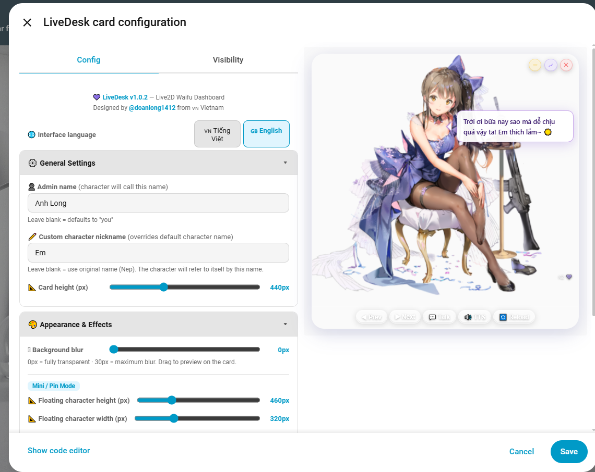
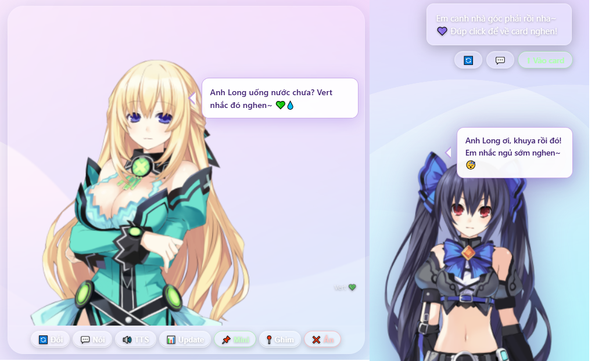

# 💜 LiveDesk

[](https://github.com/hacs/integration)


> 🇬🇧 **English version (main):** [README.md](README.md)

**Dashboard Home Assistant của bạn vừa có thêm một người bạn đồng hành.** Một nhân vật anime Live2D sống ngay trong card, theo dõi sensor thời gian thực, chào bạn bằng tên, phản ứng với nhiệt độ và thời tiết, cảnh báo khói hoặc chuyển động — và nói to mọi thứ bằng giọng thật. Ghim nhân vật vào bất kỳ view nào và cô ấy sẽ nổi trên toàn bộ dashboard của bạn, luôn hiển thị, luôn ở đó.

Một card. Không cần cài thêm gì. Chạy thẳng vào Home Assistant.

---

## 📸 Preview



---

## ✨ Điểm khác biệt

Hầu hết các Lovelace card chỉ hiển thị dữ liệu. LiveDesk **trao cho dữ liệu đó một giọng nói và một khuôn mặt**. Neptune chào buổi sáng khi bạn bước vào. Shizuku cảnh báo khi phát hiện khói. Vert nhắc khi độ ẩm quá cao. Bong bóng thoại tự chuyển đổi liên tục, và tất cả — lời chào, phản ứng, giọng nói — đều được điều khiển bởi sensor Home Assistant thực tế của bạn, theo thời gian thực.

---

## 🚀 Tính năng

---

### 💜 7 Nhân vật Anime — đổi trong một cú chạm

Bảy nhân vật Live2D anime được tuyển chọn kỹ càng, mỗi nhân vật có cá tính, lời chào và tên tự xưng riêng. Chuyển đổi giữa các nhân vật ngay trên card — nhân vật tải tức thì từ CDN, không cần file cục bộ.

| Nhân vật | Cá tính |
|----------|---------|
| **Neptune 💜** | Vui vẻ, hoạt bát, tự xưng là "Nep" |
| **Vert 💚** | Điềm tĩnh, chín chắn, kiểu onee-san |
| **Koharu 🌸** | Dịu dàng, ngọt ngào, hơi thở mùa xuân |
| **Shizuku ❄️** | Mát mẻ, gọn gàng — có file âm thanh thật |
| **Noire 🖤** | Tsundere, cố tỏ ra thờ ơ |
| **Uni 🩷** | Kiểu em gái năng động |
| **Blanc 📖** | Mọt sách trầm lặng, ít lời nhưng đáng nghe |

Nút 🔄 trên card chuyển qua lại giữa các nhân vật. Nhân vật được chọn cuối cùng được lưu qua `localStorage` — cô ấy vẫn ở đó khi bạn quay lại.

> **Shizuku** là nhân vật duy nhất có file âm thanh thật — tiếng của cô ấy sẽ phát trong các tương tác, bên cạnh TTS.

---

### 🗂️ Chế độ Mini — thu nhỏ xuống góc, ghim trên mọi view

Nhấn nút **📌 Ghim** và nhân vật sẽ thu gọn thành widget nổi nhỏ — neo vào góc dưới màn hình. Cô ấy hiển thị trong khi bạn điều hướng giữa các dashboard, view và subpage. Quay lại chế độ card đầy đủ bất cứ lúc nào chỉ với một cú chạm.

**Chế độ Mini làm gì:**
- Nhân vật thu nhỏ và nổi ở góc dưới bên phải cửa sổ trình duyệt
- Hiển thị liên tục qua tất cả các Lovelace view — cô ấy đi theo bạn khắp nơi
- Bong bóng thoại vẫn hiện với phản ứng và cảnh báo
- TTS vẫn nói — bạn sẽ nghe thấy cô ấy ngay cả khi thu nhỏ
- Nhấn vào nhân vật đang ghim để mở rộng lại thành card đầy đủ

Đây là tính năng khiến LiveDesk cảm giác như một người bạn thật sự chứ không chỉ là một card. Cô ấy luôn ở đó — không chỉ trên view dashboard mà card đang sống.

---

### 💬 Bong bóng thoại thông minh — nhận biết ngữ cảnh, luôn mới

Bong bóng thoại không chỉ nói "Xin chào." Nó biết mấy giờ rồi, thời tiết đang thế nào, và nhiệt độ bao nhiêu — rồi chào bạn theo đúng ngữ cảnh đó.

**Logic lời chào:**
- **Sáng / Trưa / Tối / Đêm** — bộ lời chào khác nhau cho từng buổi
- **Phản ứng nhiệt độ** — lạnh quá 🥶, dễ chịu 😊, nóng 🥵, hầm hập 🔥
- **Phản ứng độ ẩm** — cảnh báo khô, khoảng dễ chịu, ngột ngạt
- **Phản ứng thời tiết** — nắng ☀️, mưa 🌧️, bão ⛈️, sương mù 🌫️, tuyết ❄️, và nhiều hơn
- **Tên chủ nhân** — nhân vật gọi bạn bằng tên bạn đặt trong config
- **Tên tự xưng** — tuỳ chỉnh được (`{c}` trong mọi câu thoại sẽ thành tên cô ấy)

Bong bóng tự chuyển mỗi 3 giây qua các câu có sẵn. Bạn sẽ không bao giờ thấy cùng một lời chào hai lần liên tiếp.

---

### 🚨 Phản ứng cảnh báo thời gian thực

Kết nối binary sensor và nhân vật phản ứng ngay khi trạng thái thay đổi — không cần polling, không cần refresh.

| Sensor | Khi bật | Khi tắt |
|--------|---------|---------|
| 🚶 Chuyển động | Ngạc nhiên, phát hiện người | Nhẹ nhõm, yên tĩnh trở lại |
| 🚪 Cửa | Báo cửa mở, hỏi ai ra vào | Xác nhận cửa đóng |
| 🔥 Khói | **KHẨN CẤP — thoát ngay!** | Hết khói, thở phào |

Cảnh báo khói được ưu tiên cao nhất — câu nói mang tính khẩn cấp và quyết đoán, không vui vẻ.

---

### 🔊 TTS — 4 engine, cấu hình linh hoạt

Nhân vật nói to mọi lời chào và cảnh báo. Bốn TTS engine được hỗ trợ — chọn cái phù hợp với thiết lập của bạn.

| Engine | Mô tả |
|--------|-------|
| **Web Speech** | Giọng nói có sẵn trong trình duyệt — chạy mọi nơi, không cần cấu hình |
| **Google Translate** | Giọng Google rõ ràng qua audio tag — không cần addon HA |
| **HA Service (tts.speak)** | HA 2023.8+ native — phát trên trình duyệt hoặc loa vật lý |
| **HA Service (legacy)** | `tts.google_translate_say` / `tts.cloud_say` — thiết lập cũ |
| **None** | Tắt hoàn toàn TTS |

Tên tự xưng cấu hình được theo nhân vật — cô ấy tự giới thiệu bằng tên của mình khi TTS kích hoạt.

```yaml
tts:
  engine: ha_service
  service: tts.speak
  entity_id: tts.google_translate_vi_com
  media_player_entity_id: media_player.loa_phong_khach
  cache: true
```

---

### 🌡️ Cảm biến môi trường — phản ứng trực tiếp

Kết nối cảm biến nhiệt độ, độ ẩm và thời tiết để nhân vật phản ứng thời gian thực mỗi khi giá trị chuyển sang ngưỡng mới.

```yaml
temp_sensor:    sensor.nhiet_do
humid_sensor:   sensor.do_am
weather_entity: weather.home
```

Ngưỡng nhiệt độ: ≤16°C 🥶 · 17–22°C 😊 · 23–28°C 😊 · 29–33°C 🥵 · 34°C+ 🔥
Ngưỡng độ ẩm: ≤30% 💨 · 31–60% 💧 · 61–80% 💦 · 81%+ 🌊

---

### 🔧 Thanh công cụ thiết bị — điều khiển nhanh

Thêm bất kỳ entity Home Assistant nào vào toolbar trong card — đèn, quạt, công tắc, điều hòa, rèm, TV/loa, camera, cảm biến, tự động hóa, script, cảnh, khóa, robot hút bụi, và nhiều hơn. Card tự nhận loại thiết bị từ prefix của entity ID và áp đúng icon, nhãn tương ứng.

```yaml
entities:
  - entity: light.phong_khach
    name: Đèn phòng khách
  - entity: fan.phong_ngu
  - entity: switch.o_cam_tivi
  - entity: climate.dieu_hoa
```

Mỗi nút hiển thị trạng thái hiện tại và bật/tắt entity khi nhấn.

---

### 🎛️ Visual Config Editor

Cấu hình mọi thứ mà không cần chạm vào YAML. Editor dùng accordion section gọn gàng:

| Section | Nội dung |
|---------|----------|
| ⚙️ **Cài đặt chung** | Tên chủ nhân, tên tự xưng, chiều cao card |
| 🎨 **Giao diện** | Blur nền, kích thước chế độ mini |
| 🌡️ **Cảm biến môi trường** | Nhiệt độ, độ ẩm, entity thời tiết |
| 🚨 **Cảm biến cảnh báo** | Chuyển động, cửa, khói |
| 🔊 **TTS** | Engine, ngôn ngữ, tốc độ, pitch, cấu hình HA service |
| 🔧 **Thiết bị** | Danh sách entity kèm tên (tối đa 12) |

Badge đếm trên từng section cho biết bao nhiêu entity đã kết nối.

---

## 📦 Cài đặt

### Cách 1 — HACS (khuyên dùng, 30 giây)

**Bước 1** — Thêm repo vào HACS:

[](https://my.home-assistant.io/redirect/hacs_repository/?owner=doanlong1412&repository=live-desk&category=plugin)

> Nếu nút không hoạt động, thêm thủ công:
> **HACS → Frontend → ⋮ → Custom repositories**
> URL: `https://github.com/doanlong1412/live-desk` → Type: **Dashboard** → Add

**Bước 2** — Tìm **LiveDesk** → **Install**

**Bước 3** — Hard reload trình duyệt (`Ctrl+Shift+R`)

---

### Cách 2 — Thủ công

1. Tải file [`livedesk.js`](https://github.com/doanlong1412/live-desk/releases/latest)
2. Copy vào `/config/www/livedesk.js`
3. **Settings → Dashboards → Resources → Add resource:**
   ```
   URL:  /local/livedesk.js
   Type: JavaScript module
   ```
4. Hard reload (`Ctrl+Shift+R`)

---

## ⚙️ Cấu hình

Thêm card vào dashboard:

```yaml
type: custom:live-desk
```

Rồi nhấn **✏️ Edit** — visual editor lo hết phần còn lại.

---

### Ví dụ YAML đầy đủ

```yaml
type: custom:live-desk
name: Long                        # tên của bạn — nhân vật sẽ gọi tên này
char_nickname: Nep                # tuỳ chọn: ghi đè tên tự xưng của nhân vật
height: 440                       # chiều cao card (px)
float_height: 650                 # chiều cao nhân vật chế độ mini
float_width:  400                 # chiều rộng chế độ mini
card_blur: 8                      # độ mờ nền (0 = trong suốt hoàn toàn)

temp_sensor:    sensor.nhiet_do
humid_sensor:   sensor.do_am
weather_entity: weather.home
motion_sensor:  binary_sensor.chuyen_dong
door_sensor:    binary_sensor.cua_chinh
smoke_sensor:   binary_sensor.bao_khoi

tts:
  engine: webspeech
  lang: vi-VN
  rate: 1.05
  pitch: 1.2

entities:
  - entity: light.phong_khach
    name: Đèn phòng khách
  - entity: fan.phong_ngu
  - entity: switch.o_cam_tivi
  - entity: climate.dieu_hoa
```

---

### Tham chiếu cấu hình

| Key | Mặc định | Mô tả |
|-----|----------|-------|
| `name` | `bạn` | Tên chủ nhân — dùng trong lời chào |
| `char_nickname` | *(tên mặc định nhân vật)* | Ghi đè tên tự xưng của nhân vật |
| `height` | `440` | Chiều cao card (px) |
| `float_height` | `650` | Chiều cao nhân vật chế độ mini (px) |
| `float_width` | `400` | Chiều rộng chế độ mini (px) |
| `card_blur` | `8` | Độ mờ nền (0–30) |
| `temp_sensor` | — | Entity cảm biến nhiệt độ |
| `humid_sensor` | — | Entity cảm biến độ ẩm |
| `weather_entity` | — | Entity thời tiết HA |
| `motion_sensor` | — | Binary sensor chuyển động |
| `door_sensor` | — | Binary sensor cửa |
| `smoke_sensor` | — | Binary sensor khói / báo cháy |
| `entities` | `[]` | Danh sách thiết bị trong toolbar (tối đa 12) |

---

### Tham chiếu TTS engine

#### Web Speech (mặc định)
```yaml
tts:
  engine: webspeech
  lang: vi-VN      # tuỳ chọn
  rate: 1.05       # 0.5–2.0
  pitch: 1.2       # 0–2
```

#### Google Translate
```yaml
tts:
  engine: google_translate
  lang: vi
```

#### HA Service — tts.speak (HA 2023.8+, khuyên dùng)
```yaml
tts:
  engine: ha_service
  service: tts.speak
  entity_id: tts.google_translate_vi_com
  media_player_entity_id: media_player.loa_phong_khach   # tuỳ chọn
  cache: true
```

#### HA Service — legacy
```yaml
tts:
  engine: ha_service
  service: tts.google_translate_say
  entity_id: media_player.loa_phong_khach
  lang: vi
```

#### Tắt TTS
```yaml
tts:
  engine: none
```

---

## 🖥️ Tương thích

| | |
|---|---|
| Home Assistant | 2023.1+ |
| Lovelace | Default & custom dashboard |
| Thiết bị | Mobile & Desktop |
| Dependencies | **Không cần cài thêm** |
| Trình duyệt | Chrome, Firefox, Safari, Edge |

---

## 📋 Changelog

### v1.0.0
- 💜 **7 nhân vật anime** — Neptune, Vert, Koharu, Shizuku, Noire, Uni, Blanc — đổi qua nút 🔄, nhớ qua localStorage
- 📌 **Chế độ Mini / Ghim** — nhân vật thu gọn thành widget nổi góc màn hình, hiển thị liên tục trên mọi Lovelace view
- 💬 **Bong bóng thoại thông minh** — nhận biết thời gian, sensor-driven, tự chuyển mỗi 3 giây
- 🌡️ **Phản ứng sensor trực tiếp** — nhiệt độ, độ ẩm, điều kiện thời tiết, mỗi cái đều có câu thoại riêng
- 🚨 **Hệ thống cảnh báo thời gian thực** — chuyển động, cửa, khói với phản ứng tức thì
- 🔊 **4 TTS engine** — Web Speech, Google Translate, HA Service (tts.speak + legacy), hoặc None
- 🔧 **Toolbar thiết bị** — tối đa 12 entity, icon tự nhận theo domain
- 🎛️ **Visual Config Editor** — accordion section, không cần YAML
- 🌐 **Tên chủ nhân + tên tự xưng tuỳ chỉnh** — cá nhân hóa mọi câu thoại

---

## 📄 License

MIT — tự do sử dụng, chỉnh sửa, phân phối.
Nếu LiveDesk khiến dashboard của bạn thêm sống động, hãy ⭐ **star repo** để ủng hộ nhé!

---

## 🙏 Credits

Thiết kế và phát triển bởi **[@doanlong1412](https://github.com/doanlong1412)** từ 🇻🇳 Việt Nam.

Live2D models được host qua [jsdelivr CDN](https://www.jsdelivr.com/) — credit thuộc về các tác giả model gốc.
Live2D rendering sử dụng [live2d-widget](https://github.com/stevenjoezhang/live2d-widget).
